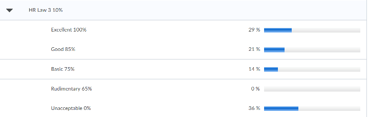

```{r, echo=FALSE, include=FALSE}
#knitr::opts_chunk$set(message = FALSE, warning = FALSE)
library(tidyverse)
options(dplyr.summarise.inform=FALSE) 
library(readxl)
```

# Objective
Data are mostly cleaned and organized; PLOs are largely matched for Standard 4 reporting; yet, there are several critically missing pieces. 1) Present the outcomes for those which are present and 2) sort out the current situation and follow up with faculty/staff for missing information (i.e. missing data, assessments, and mappings).

# Set up
Import data. Codes are externalized for reuse. As a reference:

- `mdf` or main data frame contains the rubric outcome data merged with the course/assessment information gathered from the survey. Data are cleaned up.
- `non` or non-rubric data frame is separated from the same data source as the rubric information of `mdf`. It contains the instructor's assessments of outcomes at course level. Data are cleaned up.
- `past` data frame contains the assessment outcome data from the past.
- `rowmap` data frame summarizes the mapping between PLOs and rubric rows.
```{r}
source('read.R')
source('munge.R')
```

Those scripts have been updated to use the *edited* version of the survey result data. See Note 5 for details.

Given that change, the Notebooks 1-5 are completely outdated.

# PLO Measures for Standard 4

## Overview
For Standard 4, we only need a rather small subset of the assessments available. Produce the summary of outcomes in the context of historical changes. 

- ACBSP requires 3-5 data points, so make sure to have sufficient numbers.
- ACBSP requires graphs with sample sizes.
- Nuventive requires numbers. Produce data tables along with the graphs.

Once Standard 4 is done, we can discuss weakness/shortcomings and strength/improvements in our program, then look at other courses - including the ones at an earlier stage of each program - to find *opportunities for improvement* and *close the loop*. That is, we can get to **Standard 6** analysis.

## Summarize Outcomes
Rubric outcome data are collected at individual level. Take average over `Course` level for each assignment. All the inconsistencies have been dealt with.
```{r}
# Undergrad focus for now
tbl1 <- mdf %>% filter(str_detect(Name, "Major|Minor", negate = TRUE)) %>%
  group_by(Course, Assessment, Name, PLO) %>%
  summarise(Met = mean(Met.UND.bin), Met.GRD = mean(Met.GRD.bin), n = n())
```

Non-rubric data are collected at `Section` level and as shares of students who achieved goals. Use the class size as a weight to have the proper aggregation. Moreover, keep the `PLO` column for identifying apparently-identical assessments (e.g. different parts of exams).
```{r}
tbl2 <- non %>%
  group_by(Course, Assessment, PLO) %>%
  summarise(Met = weighted.mean(x = np/n, w = n, na.rm = TRUE),
            Met.GRD = Met,
            n = sum(n, na.rm = TRUE), Name = "NA")
```

Now the outcomes are summarized in a compatible way for both rubric-based and non rubric-based assessments.
```{r}
tbl3 <- tbl1 %>% bind_rows(tbl2)
```

## Prepare
```{r}
get_outcome <- function(plotag, rrow, program, plo, grad = FALSE){
  if(is.na(plotag)){return(NA)}
  if(grad){
    tbl3 %>% filter(PLO == plotag, str_detect(Name, rrow)) %>% ungroup() %>% 
      summarize(Met = mean(Met.GRD), n = min(n)) %>%
      mutate(Program = program, PLO = plo)
  }
  else{
    tbl3 %>% filter(PLO == plotag, str_detect(Name, rrow)) %>% ungroup() %>% 
      summarize(Met = mean(Met), n = min(n)) %>%
      mutate(Program = program, PLO = plo)
  }
}
#get_outcome(plotag = "BUS 5, BUS 6", rrow = "5[a|b|c|d]",
#            program = "Business Core", plo = 5)
```

```{r}
#levels(factor(tbl3$PLO))
list.plotags <- list("Accounting" = c("ACC 1", "ACC 2", NA, "ACC 4"),
          "Business Core" = c(NA, "BUS 2", "BUS 3, BUS 5, BUS 6", "BUS 4, BUS 9",
                              "BUS 3, BUS 5, BUS 6", "BUS 3, BUS 5, BUS 6",
                              "BUS 7, BUS 8", "BUS 7, BUS 8", "BUS 4, BUS 9",
                              "BUS 10"),
          "Economics" = c("ECO 2"),
          "Human Resources Management" = paste("HRM", 1:4),
          "Management" = c(rep("MGT 1, MGT 2, MGT 3", 3), "MGT 4"),
          "MBA" = c(paste("MBA", 1:4), NA, paste("MBA", 6:8))
          )
list.rrows <- list(
  "Accounting" = rep("NA", 4),
  "Business Core" = c(NA, "Plo2", "Plo3", "Plo4", "5[a|b|c|d]", "6[e|f|g]",
                      "Plo7", "Plo8", "Plo9", ".*"),
  "Economics" = c(".*"),
  "Human Resources Management" = c("Organizational Types",
           "(Organizational Types)|(Organizational Strategy)",
           "Hr Law", ".*"),
  "Management" = c("Plo1", "Plo5", "Plo7", ".*"),
  "MBA" = rep(".*", 8)
  )
# MIS, MKT
```

```{r}
get_outcomes <- function(program, grad = FALSE){
  # Wrapper to return a combined results for each program
  lres <- list()
  plotags <- list.plotags[[program]]
  rrows <- list.rrows[[program]]
  for(i in 1:length(plotags)){
    lres[[i]] <- get_outcome(plotags[i], rrows[i], program, i, grad)
  }
  lres
}

merge_outcomes <- function(lres, program){
  # Wrapper function to merge with the historical assessment results
  lres <- lres[!is.na(lres)] # Missing assessment returns NA
  x <- bind_rows(lres)
  x <- x %>% ungroup() %>%
    transmute(`Learning Objective Number` = PLO,
              `Academic Year` = rep(2019, nrow(x)),
              `Outcome` = Met, `Sample Size` = n )
  
  y <- past %>%
    filter(Program == program,
           str_detect(`Assessment Type`, "(Internal$)|(Internal Formative)"),
           str_detect(Source, "2020")) %>% 
    select(`Learning Objective Number`, `Academic Year`,
           Outcome, `Sample Size`)
  out <- bind_rows(x, y)
  out %>% arrange(`Learning Objective Number`, `Academic Year`)
}

getmerge_outcomes <- function(program, grad = FALSE){
  lres <- get_outcomes(program, grad)
  merge_outcomes(lres, program)
}

#getmerge_outcomes("Accounting")
#past %>% filter(Program == "MBA", str_detect(`Assessment Type`, "(Internal$)|(Internal Formative)"))
```

```{r}
make_graph <- function(df.out, program){
  title <- paste0(program, ", Prevalence of Achievments Over Academic Years, by PLO")
  caption <- "Grey number represents sample size.\nFor 2019, minimum sample size is used if prevalence is computed from multiple criteria."
  
  p <- ggplot(df.out, aes(x = `Academic Year`, y = Outcome,
                          group = `Learning Objective Number`)) +
    geom_line(na.rm = TRUE) +
    geom_point(aes(color = Outcome > goal), na.rm = TRUE) +
    scale_colour_manual(values = setNames(c('blue','red'),c(T, F))) +
    geom_text(aes(`Academic Year`, 0.65, label = round(`Sample Size`, 0)),
              alpha = 0.4, na.rm = TRUE) +
    geom_hline(aes(yintercept = goal), alpha = 0.4, color = "red") +
    scale_y_continuous(labels=scales::percent, breaks = seq(0, 1, 0.2))
  p + facet_wrap(vars(`Learning Objective Number`)) +
    theme_minimal() +
    labs(title = title, caption = caption) +
    theme(axis.title = element_blank(),
          text = element_text(family = "serif"),
          panel.grid.minor.x = element_blank(),
          legend.position = "none")
}
```

## Follow Up

```{r}
survey %>% filter(`Follow up` != "NA")
```

- [ ] Fatma El-Hamidi, Spring 2020, BUS 381-002, Final Exam, No assessment for an exam?
- [x] Beth, Fall 2019, BUS 499-GW1, Simulation After Action Report, Mapped to anything? > **Same as GoVenture AAR** ...Fixed.
- [x] Dave & Paul R. Ask Beth? BUS 799, "Chapter Case Study" "Comprehensive Project". Supposed to be exam scores? >> Waiting for Stephanie.
- [x] Chris? FIN 301. "Ratio Calculation", "Ratio Interpretation Signature Assignment #3", "NPV Calculation", "Moral Hazard" (Ed inputs); FIN 301 "Ration Analysis - Rich Uncle Scenario" (Chris entered); "Signature Assignment 3", "Signature Assignment 2" (Nan entered). >> Nan's response clarified most. Helpful to know that the Signature Assignment 3 (Capital Budgeting) was discontinued. No wonder I can't have a consistent matching.
- [x] To begin with, Finance program should use FIN 302 Capital Budgeting for assessment of both 1 and 2. Likely outdated? Ask Nan. >> Okay, **FIN 301 is not used for proram assessment.** I need FIN 302 data for assessment. Remove all FIN 301 plo tags. ...Done.
- [x] Rich MKT 300. Assess PLO 1-10… while only 1-3 available?
FIN 711 for MBA 3, missing. ...Wait. It should be from 401. Eric Freeman taught and answered. >>

Some confusion. I suppose those files in 2019-20 folder are updated versions. However, worksheets contradict with the overview sheet. I don't know what data those sheets refer to.

# Outcomes
## Accounting

```{r}
acc <- getmerge_outcomes("Accounting")
knitr::kable(acc, dig=2)
```


```{r}
ref <- tibble(`Learning Objective Number` = 1:4, goal = rep(0.7, 4))
acc <- acc %>% left_join(ref, by = "Learning Objective Number")
make_graph(acc, "Accounting")
```

```{r}
x <- rowmap %>% filter(Program == "Accounting") %>%
  discard(~all(is.na(.x))) %>% map_df(~.x) %>% 
  select(-c(Program, Goal, `Last Checked`))
knitr::kable(x)
```

## Business Core
```{r}
bus <- getmerge_outcomes("Business Core")
knitr::kable(bus, dig=2)
```


```{r}
ref <- tibble(`Learning Objective Number` = 1:10, goal = c(rep(0.7, 8), 0.9, 0.7))
bus <- bus %>% left_join(ref, by = "Learning Objective Number")
make_graph(bus, "Business Core")
```


```{r}
x <- rowmap %>% filter(Program == "Business Core") %>%
  discard(~all(is.na(.x))) %>% map_df(~.x) %>% 
  select(-c(Program, Goal, `Last Checked`))
knitr::kable(x)
```

### Discussion

Sanity check 1: Numbers of students in each assignment
```{r}
mdf %>% filter(Course == "BUS 499") %>% group_by(Assessment, Name) %>% summarize(n = n()) %>% knitr::kable()
```


## Economics
ECO 301 was not offered during this term.

```{r}
eco <- getmerge_outcomes("Economics")
knitr::kable(eco, dig=2)
```

```{r}
x <- rowmap %>% filter(Program == "Economics") %>%
  discard(~all(is.na(.x))) %>% map_df(~.x) %>% 
  select(-c(Program, Goal, `Last Checked`))
knitr::kable(x)
```

```{r}
tbl3 %>% filter(Course == "ECO 421")
```

I have ECO 421 data, but rows are not identified clearly.

- [x] Ask Paul about ECO 421 >> Waiting for response

## Finance
All the assessment from FIN 302. Waiting for the data from Jon Kallis.

## Human Resource Management
```{r}
hrm <- getmerge_outcomes("Human Resources Management")
knitr::kable(hrm, dig=2)
```


```{r}
ref <- tibble(`Learning Objective Number` = 1:4, goal = rep(0.7, 4))
hrm <- hrm %>% left_join(ref, by = "Learning Objective Number")
make_graph(hrm, "Human Resources Management")
```


```{r}
x <- rowmap %>% filter(Program == "Human Resources Management") %>%
  discard(~all(is.na(.x))) %>% map_df(~.x) %>% 
  select(-c(Program, Goal, `Last Checked`))
knitr::kable(x)
```

### Discussion

There's some disparity between the instructor comment and outcome. For instance,
```{r}
survey %>% filter(Course == "HRM 400", Assessment == "Paper 3") %>% select(Analysis.Rubric) %>% knitr::kable()
```

```{r}
tbl3 %>% filter(Course == "HRM 400", Assessment == "Paper 3")
```

This is not due to mis-categorized achievement levels.
```{r}
mdf %>% filter(Course == "HRM 400", Assessment == "Paper 3", str_detect(Name, "Hr Law")) %>% group_by(LevelAchieved.Original) %>% summarize(n = n(), Score = mean(Score, na.rm = TRUE))
```

It's a small course. Let's look at details...
```{r}
mdf %>% filter(Course == "HRM 400", Assessment == "Paper 3", str_detect(Name, "Hr Law")) %>% group_by(Name) %>% summarize(n = n())
```

4 students did HR Law 1 and HR Law 2, but 8 students did HR Law 3? That doesn't make sense.

Some error with conversion?
```{r}
mdf %>% filter(Course == "HRM 400", str_detect(Name, "Hr Law")) %>% group_by(Name) %>% summarize(n = n())
```
```{r}
mdf %>% filter(Course == "HRM 400") %>% group_by(Assessment.Original, Name) %>% summarize(n = n()) %>% knitr::kable()
```

That's weird. The numbers of students differ a lot by rubric row, even though there are only three assignments. e.g. Only 3 students are graded for APA/Scholarship for Paper #1, while 14 are graded for Consistency?

As a result, the distribution of grades end up uneven.
```{r}
mdf %>% filter(Course == "HRM 400", Assessment == "Paper 3", str_detect(Name, "Hr Law")) %>% group_by(Name, LevelAchieved.Original) %>% summarize(n = n())
```

- [x] Ask Stephanie about the rubric usage >> Waiting for reply. >> See Follow up below.

A little more check. Frequencies of unique students?
```{r}
mdf %>% filter(Course == "HRM 400") %>% group_by(Section, UserId) %>% summarize(n = n()) %>% knitr::kable()
```

For 21 (?) students.

Some alternative names?
```{r}
mdf %>% filter(Course == "HRM 400", Assessment == "Paper 1") %>% group_by(Name, UserId) %>% summarize(n = n()) %>% pivot_wider(names_from = Name, values_from = n)
```

- `Process/...` rubric row has some duplicates?
- No obvious "substitute" kind


```{r}
mdf %>% filter(Course == "HRM 400", Assessment == "Paper 2") %>% group_by(Name, UserId) %>% summarize(n = n()) %>% pivot_wider(names_from = Name, values_from = n)
```

Simply missing.

```{r}
mdf %>% filter(Course == "HRM 400", Assessment == "Paper 3") %>% group_by(Name, UserId) %>% summarize(n = n()) %>% pivot_wider(names_from = Name, values_from = n)
```

#### Follow up

```{r}
mdf %>% filter(Course == "HRM 400", Assessment == "Paper 3", str_detect(Name, "Hr Law")) %>% group_by(Name, LevelAchieved.Original) %>% summarize(n = n())
```

Now I have an access to the course HRM 400 001. Checking the rubric `137778`, I don't see any issues. Here's a screenshot of the statistics page for the above rubric row.



Evidently, excellent and Basic are removed in the dataset. Is this an artifact of data munging... somehow? Check the raw data.

```{r}
fn <- "data/Rubrics.xlsx"
df <- read_xlsx(fn) %>%
  mutate(across(c(RubricId:Name, LevelAchieved), factor),
         IsScoreOverridden = (IsScoreOverridden == "True"))
df %>% filter(RubricId == 137778) %>% filter(str_detect(Name, "HR Law 3"))
```

No. Still the same. (Naturally, since I didn't remove any rows...)

This is a small class, I shall collect the data manually. The real concern is that this can be happening to any of the courses. I need to determine the cause.

#### Data Scraping
Now, let's scrape the data. I'll collect all the individual scores, but first I can use D2L statistics for a quick report.

```{r}
survey %>% filter(Course == "HRM 400") %>% select(Analysis.Rubric) %>% knitr::kable()
```

- PLO 1: Paper 1 - Organizational Type. From Unacceptable to Excellent, the distribution is {29, 36, 14, 14, 7} in 5.
- PLO 2: Paper 2 - Organizational Types and Organizational Strategy. The distributions are {23, 23, 15, 15, 23} and {0, 38, 15, 8, 38}
- PLO 3: Paper 3 - HR Law 1-3. The distributions are {14, 7, 7, 7, 64}, {21, 0, 7, 7, 64}, and {36, 0, 14, 21, 29}

Need a caution since I only see percentages and can't tell the sample numbers. That said, it's promising to see all the achievement levels.

```{r}
plo1 <- sum(c(14, 14, 7))/100
plo2 <- sum(c(15, 15, 23, 15, 8, 38))/200
plo3 <- sum(c(7, 7, 64, 7, 7, 64, 14, 21, 29))/300
plo1; plo2; plo3
tbl3 %>% filter(Course == "HRM 400")

x <- tibble(Course = rep("HRM 400", 3), 
            Assessment = paste("Paper", 1:3),
            Name = rep("NA", 3),
            PLO = 1:3,
            Met = c(plo1, plo2, plo3),
            n = rep(14, 3)
            )
x
```

```{r}
x <- x %>% transmute(`Learning Objective Number` = PLO,
                  `Academic Year` = rep(2019, nrow(x)),
                  `Outcome` = Met, `Sample Size` = n )

y <- past %>%
  filter(Program == "Human Resources Management",
         str_detect(`Assessment Type`, "(Internal$)|(Internal Formative)"),
         str_detect(Source, "2020")) %>% 
  select(`Learning Objective Number`, `Academic Year`,
         Outcome, `Sample Size`)
hrm <- bind_rows(x, y)
hrm %>% arrange(`Learning Objective Number`, `Academic Year`)
```

```{r}
ref <- tibble(`Learning Objective Number` = 1:4, goal = rep(0.7, 4))
hrm <- acc %>% left_join(ref, by = "Learning Objective Number")

program <- "Human Resources Management"

title <- paste0(program, ", Prevalence of Achievments Over Academic Years, by PLO")
caption <- "Grey number represents sample size.\nFor 2019, minimum sample size is used if prevalence is computed from multiple criteria."

p <- ggplot(hrm, aes(x = `Academic Year`, y = Outcome,
                        group = `Learning Objective Number`)) +
  geom_line(na.rm = TRUE) +
  geom_point(aes(color = Outcome > goal), na.rm = TRUE) +
  scale_colour_manual(values = setNames(c('blue','red'),c(T, F))) +
  geom_text(aes(`Academic Year`, 0.65, label = round(`Sample Size`, 0)),
            alpha = 0.4, na.rm = TRUE) +
  geom_hline(aes(yintercept = goal), alpha = 0.4, color = "red") +
  scale_y_continuous(labels=scales::percent, breaks = seq(0, 1, 0.2))
p + facet_wrap(vars(`Learning Objective Number`)) +
  theme_minimal() +
  labs(title = title, caption = caption) +
  theme(axis.title = element_blank(),
        text = element_text(family = "serif"),
        panel.grid.minor.x = element_blank(),
        legend.position = "none")
```

All set for now.


## Management
```{r}
mgt <- getmerge_outcomes("Management")
knitr::kable(mgt, dig=2)
```

```{r}
ref <- tibble(`Learning Objective Number` = 1:4, goal = rep(0.7, 4))
mgt <- mgt %>% left_join(ref, by = "Learning Objective Number")
make_graph(mgt, "Management")
```

```{r}
x <- rowmap %>% filter(Program == "Management") %>%
  discard(~all(is.na(.x))) %>% map_df(~.x) %>% 
  select(-c(Program, Goal, `Last Checked`))
knitr::kable(x)
```

### Discussion
Sanity check 1: Numbers of students in each assignment
```{r}
mdf %>% filter(Course == "BUS 345") %>% group_by(Assessment, Name) %>% summarize(n = n()) %>% knitr::kable()
```

## Marketing
All the assessment from MKT 401. Eric Freeman has one rubric outcome.
```{r}
tbl3 %>% filter(Course == "MKT 401") %>% ungroup() %>% select(Assessment, Name, n) %>% knitr::kable()
```

```{r}
mdf %>% filter(Course == "MKT 401") %>% group_by(Section, Name) %>% summarise(n = n())
```

```{r}
x <- rowmap %>% filter(Program == "Marketing") %>%
  discard(~all(is.na(.x))) %>% map_df(~.x) %>% 
  select(-c(Program, Goal, `Last Checked`))
knitr::kable(x)
```

- [x] Ask Rich?

### Discussion
Sanity check 1: Numbers of students in each assignment
```{r}
mdf %>% filter(Course == "MKT 401") %>% group_by(Assessment, Name) %>% summarize(n = n()) %>% knitr::kable()
```

PLO1; CLO1 has 110?

For one section...
```{r}
mdf %>% filter(Course == "MKT 401") %>% group_by(Section, Assessment) %>% summarize(n = n()) %>% knitr::kable()
```


```{r}
mdf %>% filter(Course == "MKT 401") %>% group_by(Section, UserId) %>% summarize(n = n()) %>% knitr::kable()
```


## MBA
Course for MBA PLO5 was not offered this term.


```{r}
mba <- getmerge_outcomes("MBA", grad = TRUE)
knitr::kable(mba, dig=2)
```

```{r}
ref <- tibble(`Learning Objective Number` = 1:8, goal = rep(0.85, 8))
mba <- mba %>% left_join(ref, by = "Learning Objective Number")
make_graph(mba, "MBA")
```

```{r}
x <- rowmap %>% filter(Program == "MBA") %>%
  discard(~all(is.na(.x))) %>% map_df(~.x) %>% 
  select(-c(Program, Goal, `Last Checked`))
knitr::kable(x)
```


# Next
